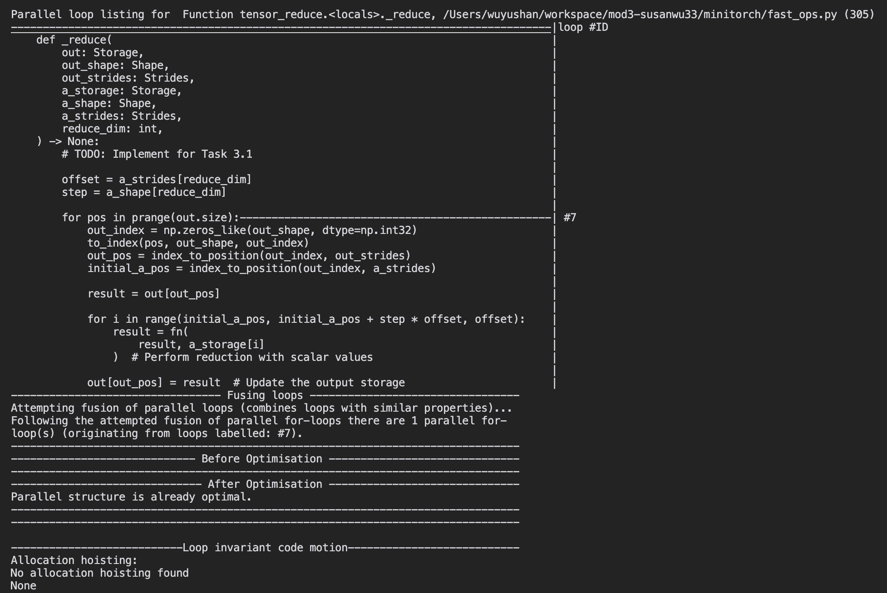

# MiniTorch Module 3


* Docs: https://minitorch.github.io/

* Overview: https://minitorch.github.io/module3.html


You will need to modify `tensor_functions.py` slightly in this assignment.

* Tests:

```
python run_tests.py
```

* Note:

Several of the tests for this assignment will only run if you are on a GPU machine and will not
run on github's test infrastructure. Please follow the instructions to setup up a colab machine
to run these tests.

This assignment requires the following files from the previous assignments. You can get these by running

```bash
python sync_previous_module.py previous-module-dir current-module-dir
```

The files that will be synced are:

        minitorch/tensor_data.py minitorch/tensor_functions.py minitorch/tensor_ops.py minitorch/operators.py minitorch/scalar.py minitorch/scalar_functions.py minitorch/module.py minitorch/autodiff.py minitorch/module.py project/run_manual.py project/run_scalar.py project/run_tensor.py minitorch/operators.py minitorch/module.py minitorch/autodiff.py minitorch/tensor.py minitorch/datasets.py minitorch/testing.py minitorch/optim.py


**Task 3.1 & 3.2**

**Diagnostics output**

<br>

<br>

<br>

<br>

<br>

<br>

<br>


**Task 3.5**

**Split Dataset**

Training Log:

* GPU
```
Epoch  0 | Loss: 10.3710 | Correct: 20 | Time: 5.40 sec
Epoch 10 | Loss: 6.2631 | Correct: 39 | Time: 1.73 sec
Epoch 20 | Loss: 5.1631 | Correct: 43 | Time: 1.73 sec
Epoch 30 | Loss: 4.6301 | Correct: 42 | Time: 1.67 sec
Epoch 40 | Loss: 2.4687 | Correct: 46 | Time: 1.75 sec
Epoch 50 | Loss: 4.3452 | Correct: 43 | Time: 1.72 sec
Epoch 60 | Loss: 2.2780 | Correct: 43 | Time: 1.85 sec
Epoch 70 | Loss: 2.7922 | Correct: 47 | Time: 1.73 sec
Epoch 80 | Loss: 2.6438 | Correct: 44 | Time: 2.03 sec
Epoch 90 | Loss: 2.0155 | Correct: 46 | Time: 1.79 sec
Epoch 100 | Loss: 1.5793 | Correct: 48 | Time: 1.81 sec
Epoch 110 | Loss: 1.1782 | Correct: 50 | Time: 1.78 sec
Epoch 120 | Loss: 1.6018 | Correct: 49 | Time: 1.76 sec
Epoch 130 | Loss: 1.2998 | Correct: 50 | Time: 1.72 sec
Epoch 140 | Loss: 0.8279 | Correct: 50 | Time: 1.72 sec
Epoch 150 | Loss: 0.9666 | Correct: 47 | Time: 1.73 sec
Epoch 160 | Loss: 1.4842 | Correct: 46 | Time: 1.80 sec
Epoch 170 | Loss: 1.4329 | Correct: 50 | Time: 1.70 sec
Epoch 180 | Loss: 1.7683 | Correct: 48 | Time: 1.98 sec
Epoch 190 | Loss: 1.5285 | Correct: 50 | Time: 1.73 sec
Epoch 200 | Loss: 2.4984 | Correct: 45 | Time: 2.06 sec
Epoch 210 | Loss: 1.4498 | Correct: 50 | Time: 1.81 sec
Epoch 220 | Loss: 0.8106 | Correct: 50 | Time: 1.80 sec
Epoch 230 | Loss: 1.2961 | Correct: 50 | Time: 1.74 sec
Epoch 240 | Loss: 0.8604 | Correct: 48 | Time: 1.71 sec
Epoch 250 | Loss: 1.0107 | Correct: 50 | Time: 1.75 sec
Epoch 260 | Loss: 0.3998 | Correct: 48 | Time: 1.68 sec
Epoch 270 | Loss: 0.8337 | Correct: 50 | Time: 1.68 sec
Epoch 280 | Loss: 0.3427 | Correct: 50 | Time: 1.71 sec
Epoch 290 | Loss: 0.4418 | Correct: 49 | Time: 1.70 sec
Epoch 300 | Loss: 0.6569 | Correct: 50 | Time: 1.73 sec
Epoch 310 | Loss: 0.8980 | Correct: 50 | Time: 1.71 sec
Epoch 320 | Loss: 0.4056 | Correct: 50 | Time: 1.74 sec
Epoch 330 | Loss: 0.4045 | Correct: 50 | Time: 1.70 sec
Epoch 340 | Loss: 0.3091 | Correct: 50 | Time: 1.79 sec
Epoch 350 | Loss: 0.8959 | Correct: 50 | Time: 1.72 sec
Epoch 360 | Loss: 0.8522 | Correct: 50 | Time: 1.70 sec
Epoch 370 | Loss: 0.5796 | Correct: 50 | Time: 1.72 sec
Epoch 380 | Loss: 0.1927 | Correct: 50 | Time: 1.71 sec
Epoch 390 | Loss: 0.7573 | Correct: 50 | Time: 1.69 sec
Epoch 400 | Loss: 0.1349 | Correct: 50 | Time: 1.89 sec
Epoch 410 | Loss: 0.2798 | Correct: 50 | Time: 1.69 sec
Epoch 420 | Loss: 0.2595 | Correct: 50 | Time: 2.14 sec
Epoch 430 | Loss: 0.6617 | Correct: 50 | Time: 1.71 sec
Epoch 440 | Loss: 0.5368 | Correct: 50 | Time: 2.34 sec
Epoch 450 | Loss: 0.1668 | Correct: 50 | Time: 1.70 sec
Epoch 460 | Loss: 0.0252 | Correct: 50 | Time: 2.47 sec
Epoch 470 | Loss: 0.6325 | Correct: 50 | Time: 1.73 sec
Epoch 480 | Loss: 0.1122 | Correct: 50 | Time: 2.57 sec
Epoch 490 | Loss: 0.6888 | Correct: 50 | Time: 1.72 sec
```

* CPU

```
Epoch  0 | Loss: 5.2165 | Correct: 40 | Time: 19.10 sec
Epoch 10 | Loss: 3.6640 | Correct: 38 | Time: 0.18 sec
Epoch 20 | Loss: 4.5610 | Correct: 41 | Time: 0.18 sec
Epoch 30 | Loss: 3.3313 | Correct: 41 | Time: 0.19 sec
Epoch 40 | Loss: 4.1339 | Correct: 48 | Time: 0.18 sec
Epoch 50 | Loss: 1.8944 | Correct: 50 | Time: 0.18 sec
Epoch 60 | Loss: 2.4217 | Correct: 48 | Time: 0.17 sec
Epoch 70 | Loss: 3.0675 | Correct: 46 | Time: 0.19 sec
Epoch 80 | Loss: 1.3652 | Correct: 50 | Time: 0.33 sec
Epoch 90 | Loss: 1.3525 | Correct: 49 | Time: 0.18 sec
Epoch 100 | Loss: 1.1200 | Correct: 49 | Time: 0.18 sec
Epoch 110 | Loss: 1.3845 | Correct: 50 | Time: 0.18 sec
Epoch 120 | Loss: 0.6664 | Correct: 50 | Time: 0.17 sec
Epoch 130 | Loss: 1.4518 | Correct: 50 | Time: 0.19 sec
Epoch 140 | Loss: 0.7180 | Correct: 50 | Time: 0.29 sec
Epoch 150 | Loss: 1.4761 | Correct: 50 | Time: 0.18 sec
Epoch 160 | Loss: 0.7136 | Correct: 50 | Time: 0.18 sec
Epoch 170 | Loss: 0.2611 | Correct: 50 | Time: 0.18 sec
Epoch 180 | Loss: 0.9740 | Correct: 50 | Time: 0.20 sec
Epoch 190 | Loss: 0.7777 | Correct: 50 | Time: 0.17 sec
Epoch 200 | Loss: 0.6789 | Correct: 50 | Time: 0.40 sec
Epoch 210 | Loss: 0.8476 | Correct: 50 | Time: 0.17 sec
Epoch 220 | Loss: 0.1905 | Correct: 50 | Time: 0.18 sec
Epoch 230 | Loss: 0.9525 | Correct: 50 | Time: 0.19 sec
Epoch 240 | Loss: 0.3187 | Correct: 50 | Time: 0.17 sec
Epoch 250 | Loss: 0.8743 | Correct: 50 | Time: 0.18 sec
Epoch 260 | Loss: 0.6309 | Correct: 50 | Time: 0.32 sec
Epoch 270 | Loss: 0.1842 | Correct: 50 | Time: 0.18 sec
Epoch 280 | Loss: 0.5271 | Correct: 50 | Time: 0.19 sec
Epoch 290 | Loss: 0.4292 | Correct: 50 | Time: 0.17 sec
Epoch 300 | Loss: 0.2754 | Correct: 50 | Time: 0.18 sec
Epoch 310 | Loss: 0.2780 | Correct: 50 | Time: 0.18 sec
Epoch 320 | Loss: 0.1554 | Correct: 50 | Time: 0.18 sec
Epoch 330 | Loss: 0.3538 | Correct: 50 | Time: 0.18 sec
Epoch 340 | Loss: 0.6234 | Correct: 50 | Time: 0.18 sec
Epoch 350 | Loss: 0.2177 | Correct: 50 | Time: 0.18 sec
Epoch 360 | Loss: 0.2358 | Correct: 50 | Time: 0.18 sec
Epoch 370 | Loss: 0.1796 | Correct: 50 | Time: 0.18 sec
Epoch 380 | Loss: 0.3181 | Correct: 50 | Time: 0.19 sec
Epoch 390 | Loss: 0.1396 | Correct: 50 | Time: 0.20 sec
Epoch 400 | Loss: 0.3415 | Correct: 50 | Time: 0.18 sec
Epoch 410 | Loss: 0.0939 | Correct: 50 | Time: 0.18 sec
Epoch 420 | Loss: 0.3073 | Correct: 50 | Time: 0.18 sec
Epoch 430 | Loss: 0.3515 | Correct: 50 | Time: 0.18 sec
Epoch 440 | Loss: 0.0686 | Correct: 50 | Time: 0.19 sec
Epoch 450 | Loss: 0.2823 | Correct: 50 | Time: 0.34 sec
Epoch 460 | Loss: 0.1385 | Correct: 50 | Time: 0.18 sec
Epoch 470 | Loss: 0.1326 | Correct: 50 | Time: 0.18 sec
Epoch 480 | Loss: 0.4152 | Correct: 50 | Time: 0.17 sec
Epoch 490 | Loss: 0.1566 | Correct: 50 | Time: 0.19 sec
```


**Simple Dataset**

Training Log:

* GPU
```
Epoch  0 | Loss: 4.4870 | Correct: 33 | Time: 3.81 sec
Epoch 10 | Loss: 1.4294 | Correct: 48 | Time: 1.69 sec
Epoch 20 | Loss: 1.4806 | Correct: 50 | Time: 1.68 sec
Epoch 30 | Loss: 0.5973 | Correct: 50 | Time: 1.68 sec
Epoch 40 | Loss: 0.2415 | Correct: 50 | Time: 1.74 sec
Epoch 50 | Loss: 0.9304 | Correct: 50 | Time: 1.70 sec
Epoch 60 | Loss: 0.5034 | Correct: 50 | Time: 1.72 sec
Epoch 70 | Loss: 0.3047 | Correct: 50 | Time: 1.74 sec
Epoch 80 | Loss: 0.5498 | Correct: 50 | Time: 1.80 sec
Epoch 90 | Loss: 0.5127 | Correct: 50 | Time: 1.79 sec
Epoch 100 | Loss: 0.2489 | Correct: 50 | Time: 1.79 sec
Epoch 110 | Loss: 0.0386 | Correct: 50 | Time: 1.78 sec
Epoch 120 | Loss: 0.0420 | Correct: 50 | Time: 1.75 sec
Epoch 130 | Loss: 0.2892 | Correct: 50 | Time: 1.70 sec
Epoch 140 | Loss: 0.0462 | Correct: 50 | Time: 1.72 sec
Epoch 150 | Loss: 0.1441 | Correct: 50 | Time: 1.70 sec
Epoch 160 | Loss: 0.1274 | Correct: 50 | Time: 1.67 sec
Epoch 170 | Loss: 0.0098 | Correct: 50 | Time: 1.70 sec
Epoch 180 | Loss: 0.1807 | Correct: 50 | Time: 1.69 sec
Epoch 190 | Loss: 0.0361 | Correct: 50 | Time: 1.70 sec
Epoch 200 | Loss: 0.0794 | Correct: 50 | Time: 1.72 sec
Epoch 210 | Loss: 0.2309 | Correct: 50 | Time: 1.73 sec
Epoch 220 | Loss: 0.1799 | Correct: 50 | Time: 1.69 sec
Epoch 230 | Loss: 0.2000 | Correct: 50 | Time: 1.69 sec
Epoch 240 | Loss: 0.1654 | Correct: 50 | Time: 1.72 sec
Epoch 250 | Loss: 0.1225 | Correct: 50 | Time: 1.70 sec
Epoch 260 | Loss: 0.0270 | Correct: 50 | Time: 1.67 sec
Epoch 270 | Loss: 0.0920 | Correct: 50 | Time: 1.69 sec
Epoch 280 | Loss: 0.1413 | Correct: 50 | Time: 1.76 sec
Epoch 290 | Loss: 0.1756 | Correct: 50 | Time: 1.70 sec
Epoch 300 | Loss: 0.1092 | Correct: 50 | Time: 1.69 sec
Epoch 310 | Loss: 0.0023 | Correct: 50 | Time: 1.68 sec
Epoch 320 | Loss: 0.1483 | Correct: 50 | Time: 1.71 sec
Epoch 330 | Loss: 0.0423 | Correct: 50 | Time: 1.73 sec
Epoch 340 | Loss: 0.0752 | Correct: 50 | Time: 1.69 sec
Epoch 350 | Loss: 0.0067 | Correct: 50 | Time: 1.71 sec
Epoch 360 | Loss: 0.0451 | Correct: 50 | Time: 1.69 sec
Epoch 370 | Loss: 0.0527 | Correct: 50 | Time: 1.85 sec
Epoch 380 | Loss: 0.0311 | Correct: 50 | Time: 1.70 sec
Epoch 390 | Loss: 0.0263 | Correct: 50 | Time: 2.17 sec
Epoch 400 | Loss: 0.0419 | Correct: 50 | Time: 1.72 sec
Epoch 410 | Loss: 0.0852 | Correct: 50 | Time: 2.41 sec
Epoch 420 | Loss: 0.0516 | Correct: 50 | Time: 1.70 sec
Epoch 430 | Loss: 0.0179 | Correct: 50 | Time: 2.12 sec
Epoch 440 | Loss: 0.0208 | Correct: 50 | Time: 1.68 sec
Epoch 450 | Loss: 0.0259 | Correct: 50 | Time: 2.37 sec
Epoch 460 | Loss: 0.0237 | Correct: 50 | Time: 1.73 sec
Epoch 470 | Loss: 0.0859 | Correct: 50 | Time: 2.63 sec
Epoch 480 | Loss: 0.0273 | Correct: 50 | Time: 1.70 sec
Epoch 490 | Loss: 0.0051 | Correct: 50 | Time: 2.54 sec
```

* CPU

```
Epoch  0 | Loss: 5.7650 | Correct: 34 | Time: 18.10 sec
Epoch 10 | Loss: 2.0860 | Correct: 49 | Time: 0.18 sec
Epoch 20 | Loss: 1.6155 | Correct: 49 | Time: 0.18 sec
Epoch 30 | Loss: 0.3261 | Correct: 49 | Time: 0.18 sec
Epoch 40 | Loss: 0.5624 | Correct: 49 | Time: 0.19 sec
Epoch 50 | Loss: 0.9308 | Correct: 50 | Time: 0.18 sec
Epoch 60 | Loss: 0.8334 | Correct: 49 | Time: 0.18 sec
Epoch 70 | Loss: 0.6058 | Correct: 49 | Time: 0.18 sec
Epoch 80 | Loss: 0.4752 | Correct: 50 | Time: 0.19 sec
Epoch 90 | Loss: 0.4591 | Correct: 50 | Time: 0.18 sec
Epoch 100 | Loss: 0.7712 | Correct: 50 | Time: 0.18 sec
Epoch 110 | Loss: 0.2198 | Correct: 50 | Time: 0.26 sec
Epoch 120 | Loss: 0.8058 | Correct: 50 | Time: 0.18 sec
Epoch 130 | Loss: 0.2270 | Correct: 50 | Time: 0.19 sec
Epoch 140 | Loss: 0.0657 | Correct: 50 | Time: 0.20 sec
Epoch 150 | Loss: 0.1241 | Correct: 50 | Time: 0.17 sec
Epoch 160 | Loss: 0.5934 | Correct: 50 | Time: 0.18 sec
Epoch 170 | Loss: 0.3015 | Correct: 50 | Time: 0.34 sec
Epoch 180 | Loss: 0.5462 | Correct: 50 | Time: 0.18 sec
Epoch 190 | Loss: 0.0220 | Correct: 50 | Time: 0.19 sec
Epoch 200 | Loss: 0.1939 | Correct: 50 | Time: 0.18 sec
Epoch 210 | Loss: 0.1777 | Correct: 50 | Time: 0.18 sec
Epoch 220 | Loss: 0.0192 | Correct: 50 | Time: 0.18 sec
Epoch 230 | Loss: 0.0088 | Correct: 50 | Time: 0.35 sec
Epoch 240 | Loss: 0.0954 | Correct: 50 | Time: 0.19 sec
Epoch 250 | Loss: 0.0329 | Correct: 50 | Time: 0.17 sec
Epoch 260 | Loss: 0.1073 | Correct: 50 | Time: 0.17 sec
Epoch 270 | Loss: 0.0005 | Correct: 50 | Time: 0.18 sec
Epoch 280 | Loss: 0.5287 | Correct: 50 | Time: 0.18 sec
Epoch 290 | Loss: 0.0136 | Correct: 50 | Time: 0.38 sec
Epoch 300 | Loss: 0.0099 | Correct: 50 | Time: 0.18 sec
Epoch 310 | Loss: 0.4438 | Correct: 50 | Time: 0.17 sec
Epoch 320 | Loss: 0.3799 | Correct: 50 | Time: 0.18 sec
Epoch 330 | Loss: 0.0034 | Correct: 50 | Time: 0.18 sec
Epoch 340 | Loss: 0.4347 | Correct: 50 | Time: 0.19 sec
Epoch 350 | Loss: 0.0631 | Correct: 50 | Time: 0.19 sec
Epoch 360 | Loss: 0.1269 | Correct: 50 | Time: 0.17 sec
Epoch 370 | Loss: 0.4063 | Correct: 50 | Time: 0.17 sec
Epoch 380 | Loss: 0.0045 | Correct: 50 | Time: 0.17 sec
Epoch 390 | Loss: 0.0112 | Correct: 50 | Time: 0.17 sec
Epoch 400 | Loss: 0.3802 | Correct: 50 | Time: 0.18 sec
Epoch 410 | Loss: 0.3560 | Correct: 50 | Time: 0.18 sec
Epoch 420 | Loss: 0.0941 | Correct: 50 | Time: 0.30 sec
Epoch 430 | Loss: 0.0957 | Correct: 50 | Time: 0.18 sec
Epoch 440 | Loss: 0.3146 | Correct: 50 | Time: 0.18 sec
Epoch 450 | Loss: 0.0826 | Correct: 50 | Time: 0.18 sec
Epoch 460 | Loss: 0.1828 | Correct: 50 | Time: 0.17 sec
Epoch 470 | Loss: 0.0021 | Correct: 50 | Time: 0.18 sec
Epoch 480 | Loss: 0.0041 | Correct: 50 | Time: 0.35 sec
Epoch 490 | Loss: 0.0679 | Correct: 50 | Time: 0.19 sec
```


**XOR Dataset**

Training Log:

* GPU

```
Epoch  0 | Loss: 6.5310 | Correct: 36 | Time: 4.32 sec
Epoch 10 | Loss: 3.2648 | Correct: 39 | Time: 1.71 sec
Epoch 20 | Loss: 8.1109 | Correct: 39 | Time: 1.70 sec
Epoch 30 | Loss: 4.5432 | Correct: 44 | Time: 1.70 sec
Epoch 40 | Loss: 5.0010 | Correct: 45 | Time: 1.73 sec
Epoch 50 | Loss: 4.3611 | Correct: 46 | Time: 1.68 sec
Epoch 60 | Loss: 2.2604 | Correct: 46 | Time: 1.75 sec
Epoch 70 | Loss: 4.2620 | Correct: 44 | Time: 1.70 sec
Epoch 80 | Loss: 1.4764 | Correct: 48 | Time: 1.78 sec
Epoch 90 | Loss: 1.8046 | Correct: 47 | Time: 1.77 sec
Epoch 100 | Loss: 0.8477 | Correct: 47 | Time: 1.75 sec
Epoch 110 | Loss: 1.4926 | Correct: 47 | Time: 1.77 sec
Epoch 120 | Loss: 2.0944 | Correct: 47 | Time: 1.76 sec
Epoch 130 | Loss: 1.4576 | Correct: 48 | Time: 1.75 sec
Epoch 140 | Loss: 0.3522 | Correct: 48 | Time: 1.69 sec
Epoch 150 | Loss: 3.0237 | Correct: 47 | Time: 1.77 sec
Epoch 160 | Loss: 1.2002 | Correct: 48 | Time: 1.68 sec
Epoch 170 | Loss: 3.0485 | Correct: 47 | Time: 1.70 sec
Epoch 180 | Loss: 1.1266 | Correct: 47 | Time: 1.69 sec
Epoch 190 | Loss: 2.1256 | Correct: 49 | Time: 1.71 sec
Epoch 200 | Loss: 2.5492 | Correct: 48 | Time: 1.91 sec
Epoch 210 | Loss: 0.2828 | Correct: 48 | Time: 1.69 sec
Epoch 220 | Loss: 2.0262 | Correct: 48 | Time: 2.08 sec
Epoch 230 | Loss: 0.3769 | Correct: 48 | Time: 1.74 sec
Epoch 240 | Loss: 1.4012 | Correct: 49 | Time: 2.25 sec
Epoch 250 | Loss: 2.0227 | Correct: 48 | Time: 1.69 sec
Epoch 260 | Loss: 0.4289 | Correct: 48 | Time: 2.94 sec
Epoch 270 | Loss: 0.7480 | Correct: 48 | Time: 1.69 sec
Epoch 280 | Loss: 0.5464 | Correct: 48 | Time: 2.58 sec
Epoch 290 | Loss: 0.7923 | Correct: 48 | Time: 1.72 sec
Epoch 300 | Loss: 1.4341 | Correct: 49 | Time: 2.34 sec
Epoch 310 | Loss: 2.5789 | Correct: 48 | Time: 1.72 sec
Epoch 320 | Loss: 0.2685 | Correct: 48 | Time: 2.10 sec
Epoch 330 | Loss: 0.1937 | Correct: 48 | Time: 1.69 sec
Epoch 340 | Loss: 0.5471 | Correct: 49 | Time: 1.77 sec
Epoch 350 | Loss: 0.1183 | Correct: 48 | Time: 1.70 sec
Epoch 360 | Loss: 0.9200 | Correct: 49 | Time: 1.74 sec
Epoch 370 | Loss: 0.4698 | Correct: 49 | Time: 1.67 sec
Epoch 380 | Loss: 1.6103 | Correct: 49 | Time: 1.69 sec
Epoch 390 | Loss: 0.5436 | Correct: 49 | Time: 1.71 sec
Epoch 400 | Loss: 0.2149 | Correct: 49 | Time: 1.69 sec
Epoch 410 | Loss: 0.1475 | Correct: 49 | Time: 1.73 sec
Epoch 420 | Loss: 0.3450 | Correct: 49 | Time: 1.70 sec
Epoch 430 | Loss: 0.4225 | Correct: 48 | Time: 1.68 sec
Epoch 440 | Loss: 1.2609 | Correct: 49 | Time: 1.67 sec
Epoch 450 | Loss: 1.4707 | Correct: 49 | Time: 1.70 sec
Epoch 460 | Loss: 2.1441 | Correct: 49 | Time: 1.73 sec
Epoch 470 | Loss: 0.2032 | Correct: 49 | Time: 1.70 sec
Epoch 480 | Loss: 0.2336 | Correct: 49 | Time: 1.71 sec
Epoch 490 | Loss: 0.1789 | Correct: 49 | Time: 2.00 sec
```

* CPU

```
Epoch  0 | Loss: 7.0849 | Correct: 31 | Time: 18.96 sec
Epoch 10 | Loss: 5.4774 | Correct: 37 | Time: 0.45 sec
Epoch 20 | Loss: 3.9817 | Correct: 43 | Time: 0.18 sec
Epoch 30 | Loss: 4.0080 | Correct: 46 | Time: 0.18 sec
Epoch 40 | Loss: 3.0523 | Correct: 46 | Time: 0.18 sec
Epoch 50 | Loss: 2.8899 | Correct: 46 | Time: 0.19 sec
Epoch 60 | Loss: 1.0188 | Correct: 47 | Time: 0.18 sec
Epoch 70 | Loss: 2.4584 | Correct: 47 | Time: 0.18 sec
Epoch 80 | Loss: 1.7838 | Correct: 47 | Time: 0.34 sec
Epoch 90 | Loss: 0.9887 | Correct: 47 | Time: 0.19 sec
Epoch 100 | Loss: 1.9340 | Correct: 47 | Time: 0.18 sec
Epoch 110 | Loss: 1.6359 | Correct: 47 | Time: 0.18 sec
Epoch 120 | Loss: 1.7464 | Correct: 47 | Time: 0.18 sec
Epoch 130 | Loss: 2.3359 | Correct: 48 | Time: 0.18 sec
Epoch 140 | Loss: 1.6109 | Correct: 49 | Time: 0.37 sec
Epoch 150 | Loss: 2.5392 | Correct: 48 | Time: 0.19 sec
Epoch 160 | Loss: 0.8879 | Correct: 48 | Time: 0.18 sec
Epoch 170 | Loss: 1.8651 | Correct: 49 | Time: 0.18 sec
Epoch 180 | Loss: 0.6388 | Correct: 49 | Time: 0.18 sec
Epoch 190 | Loss: 0.6578 | Correct: 48 | Time: 0.19 sec
Epoch 200 | Loss: 1.4863 | Correct: 49 | Time: 0.38 sec
Epoch 210 | Loss: 0.5613 | Correct: 49 | Time: 0.17 sec
Epoch 220 | Loss: 0.9852 | Correct: 49 | Time: 0.18 sec
Epoch 230 | Loss: 0.4427 | Correct: 49 | Time: 0.18 sec
Epoch 240 | Loss: 2.4577 | Correct: 48 | Time: 0.18 sec
Epoch 250 | Loss: 0.3750 | Correct: 49 | Time: 0.20 sec
Epoch 260 | Loss: 0.6938 | Correct: 50 | Time: 0.39 sec
Epoch 270 | Loss: 0.2328 | Correct: 50 | Time: 0.18 sec
Epoch 280 | Loss: 1.9250 | Correct: 50 | Time: 0.18 sec
Epoch 290 | Loss: 0.6108 | Correct: 50 | Time: 0.18 sec
Epoch 300 | Loss: 0.5986 | Correct: 50 | Time: 0.19 sec
Epoch 310 | Loss: 0.8899 | Correct: 50 | Time: 0.18 sec
Epoch 320 | Loss: 0.3894 | Correct: 50 | Time: 0.18 sec
Epoch 330 | Loss: 1.3284 | Correct: 50 | Time: 0.18 sec
Epoch 340 | Loss: 1.0406 | Correct: 50 | Time: 0.18 sec
Epoch 350 | Loss: 0.3410 | Correct: 49 | Time: 0.19 sec
Epoch 360 | Loss: 0.5553 | Correct: 49 | Time: 0.18 sec
Epoch 370 | Loss: 0.1664 | Correct: 50 | Time: 0.17 sec
Epoch 380 | Loss: 0.9873 | Correct: 50 | Time: 0.17 sec
Epoch 390 | Loss: 0.3827 | Correct: 50 | Time: 0.39 sec
Epoch 400 | Loss: 0.2683 | Correct: 49 | Time: 0.19 sec
Epoch 410 | Loss: 0.2208 | Correct: 50 | Time: 0.17 sec
Epoch 420 | Loss: 0.8719 | Correct: 50 | Time: 0.18 sec
Epoch 430 | Loss: 0.4270 | Correct: 50 | Time: 0.18 sec
Epoch 440 | Loss: 0.4934 | Correct: 50 | Time: 0.17 sec
Epoch 450 | Loss: 0.0332 | Correct: 50 | Time: 0.36 sec
Epoch 460 | Loss: 0.5353 | Correct: 50 | Time: 0.19 sec
Epoch 470 | Loss: 0.9431 | Correct: 50 | Time: 0.17 sec
Epoch 480 | Loss: 0.3846 | Correct: 50 | Time: 0.18 sec
Epoch 490 | Loss: 0.7032 | Correct: 50 | Time: 0.17 sec
```